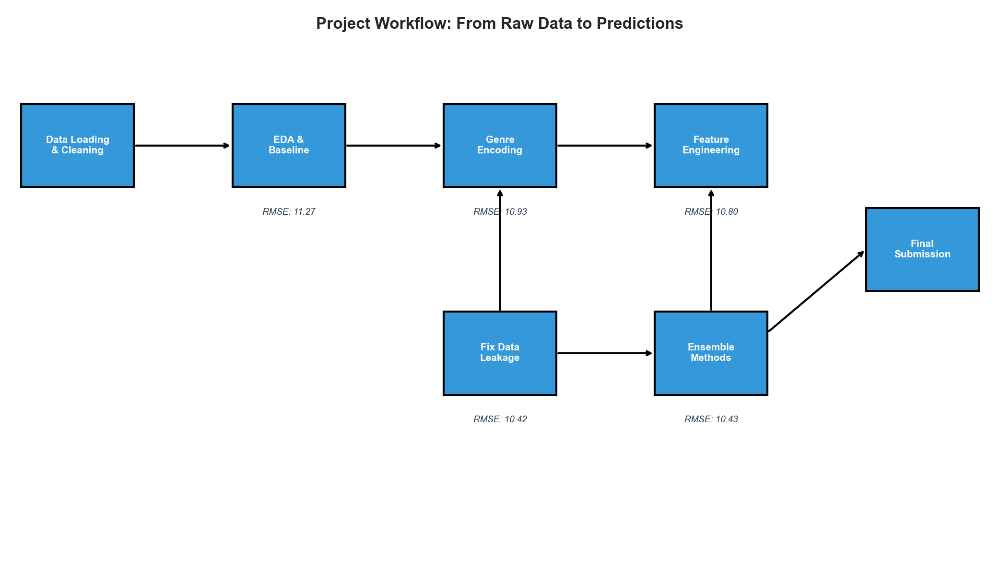
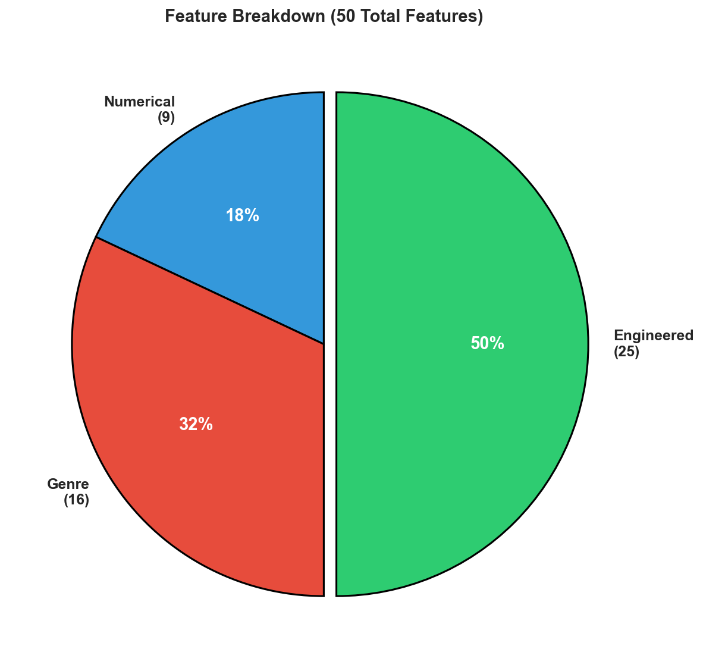
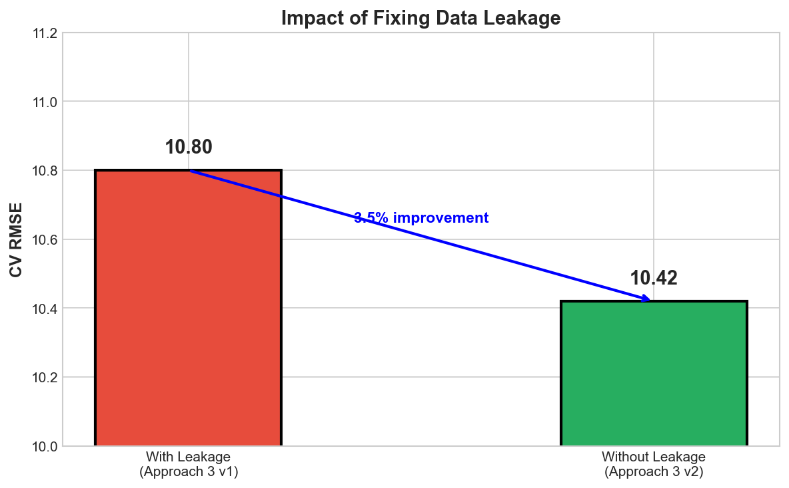
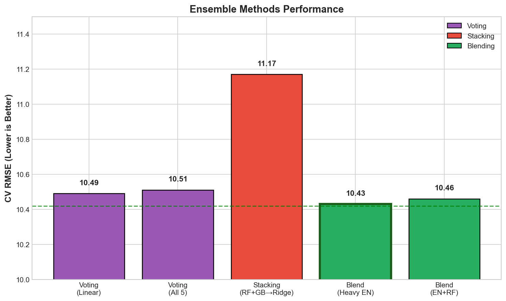
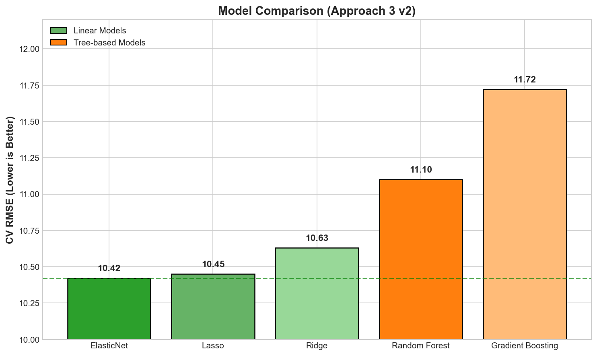
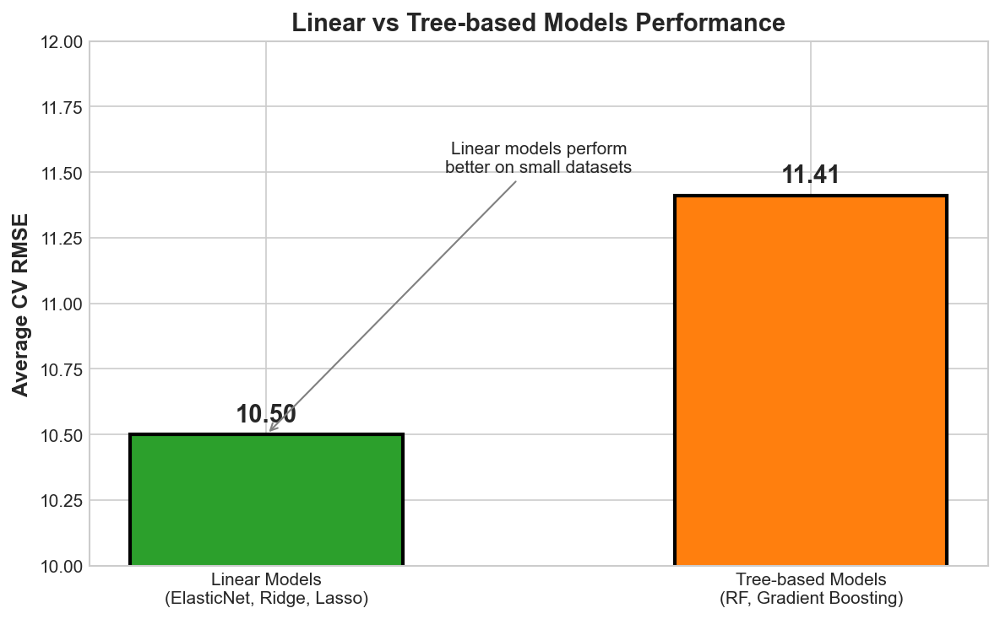
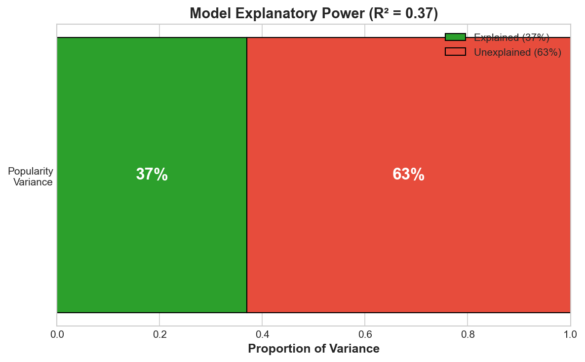
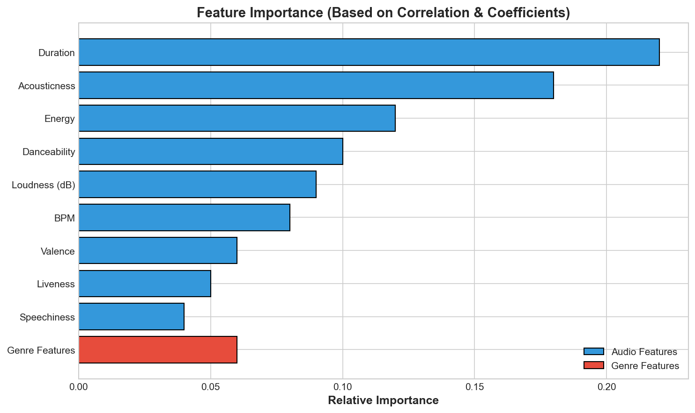

# Spotify Song Popularity Prediction


**Predicting Spotify song popularity using audio features and genre information. Best CV result: RMSE 10.42 (5-fold CV, preprocessing inside folds) with ElasticNet on 453 training songs.**


---

## Table of Contents

- [Problem Statement](#problem-statement)
- [Project Workflow](#project-workflow)
- [Dataset](#dataset)
- [Methodology](#methodology)
- [Approaches](#approaches)
- [Results](#results)
- [Key Findings](#key-findings)
- [Technologies Used](#technologies-used)
- [Project Structure](#project-structure)
- [How to Run](#how-to-run)
- [Author](#author)

---

## Problem Statement

What makes a song popular on Spotify? This project predicts song **popularity scores** using audio features and metadata from the [CS-985-6 Spotify Regression Problem 2026](https://www.kaggle.com/competitions/cs-985-6-spotify-regression-problem-2026) Kaggle competition. Through **4 iterative approaches**, each building on insights from the previous one, the project systematically improves predictions by exploring genre encoding strategies, feature engineering techniques, and ensemble methods.

---

## Project Workflow

The project follows an iterative improvement approach, where each step builds on lessons learned from the previous one:



### Approach Progression


**Key Insight:** Better CV scores don't always mean better Kaggle scores. The test set distribution matters!

---

## Dataset

| Property | Details |
|----------|---------|
| **Source** | [Kaggle Competition](https://www.kaggle.com/competitions/cs-985-6-spotify-regression-problem-2026) |
| **Training Size** | 453 songs |
| **Test Size** | 114 songs |
| **Features** | 9 numerical + 1 categorical |
| **Target** | Popularity score (0-100) |

### Feature Overview



| Feature | Description | Range | Notes |
|---------|-------------|-------|-------|
| `bpm` | Beats per minute | 60-200+ | Song tempo |
| `nrgy` | Energy level | 0-100 | Intensity and activity |
| `dnce` | Danceability | 0-100 | Rhythm stability, beat strength |
| `dB` | Loudness | -60 to 0 | Average decibels |
| `live` | Liveness | 0-100 | Presence of audience |
| `val` | Valence | 0-100 | Musical positivity |
| `dur` | Duration | seconds | Song length |
| `acous` | Acousticness | 0-100 | Acoustic vs electronic |
| `spch` | Speechiness | 0-100 | Spoken words presence |
| `top genre` | Genre | text | 149 unique categories |

---

## Methodology

### 1. Exploratory Data Analysis
- Analyzed distribution of popularity scores (target variable)
- Identified correlations between features and target
- Examined genre distribution (149 unique genres, highly imbalanced)
- Detected that duration and acousticness have strongest correlations

### 2. Data Preprocessing
- Handled missing genre values (filled with 'Unknown')
- Applied one-hot encoding for genre (top N most frequent)
- Scaled numerical features using StandardScaler
- Genre dummies left unscaled (binary features)

### 3. Feature Engineering

Created 25 engineered features across 5 categories:

| Category | Features | Example |
|----------|----------|---------|
| **Interactions** | 6 | energy × danceability |
| **Ratios** | 4 | energy per BPM |
| **Polynomial** | 4 | duration squared |
| **Binning** | 8 | is_acoustic, bpm_slow |
| **Composites** | 3 | party_score, chill_score |

### 4. Data Leakage Prevention

**The Problem:** In early experiments, I computed correlations on the full dataset before splitting. This allowed validation data to influence feature selection.

**The Fix:**
- Split data BEFORE any analysis
- Learn genre encoding from training fold only
- Compute correlations inside each CV fold
- Apply all preprocessing inside the cross-validation loop



### 5. Model Selection and Evaluation

- **Evaluation:** 5-fold cross-validation with RMSE metric
- **Linear Models:** Ridge, Lasso, ElasticNet (features scaled)
- **Tree Models:** Random Forest, Gradient Boosting (features unscaled)
- **Ensembles:** Voting, Stacking, Blending

---

## Approaches

### Baseline: EDA and Simple Models
**Notebook:** `spotify_popularity_prediction.ipynb`

- Exploratory data analysis
- Numerical features only (no genre)
- Basic regression models
- **CV RMSE: 11.27**

### Approach 1: Genre Encoding (Top N One-Hot)
**Notebook:** `approach1_genre_separate.ipynb`

- Tested N = 5, 10, 15 genres
- Best stability at N = 15
- Remaining genres grouped as "other"
- **CV RMSE: 10.93** (Random Forest)

### Approach 2: Hybrid Genre Grouping
**Notebook:** `approach2_genre_hybrid.ipynb`

- Grouped genres semantically (pop, rock, hip hop, etc.)
- Combined frequency-based and semantic grouping
- Reduced genre dimensions
- **CV RMSE: 11.05** (Ridge)

### Approach 3 v1: Feature Engineering
**Notebook:** `approach3_feature_engineering.ipynb`

- Added 25 engineered features
- Interaction terms, ratios, polynomial features
- **Potential data leakage** (correlations before split)
- **CV RMSE: 10.80** (Ridge)

### Approach 3 v2: Feature Engineering (Leakage-Safe)
**Notebook:** `approach3_feature_engineering_v2.ipynb`

- Fixed data leakage issues
- Proper preprocessing inside each CV fold
- Genre encoding learned from fold-train only
- **CV RMSE: 10.42** (ElasticNet) - Best single model

### Approach 4: Ensemble Methods
**Notebook:** `approach4_ensemble_methods.ipynb`

- Voting: Simple average of predictions
- Stacking: Meta-learner combines base models
- Blending: Weighted average with custom weights
- **CV RMSE: 10.43** (Heavy ElasticNet blend)



---

## Results

### Model Comparison



| Model | CV RMSE | CV R-squared | Type |
|-------|---------|--------------|------|
| **ElasticNet** | **10.42** | **0.37** | Linear |
| Lasso | 10.45 | 0.37 | Linear |
| Ridge | 10.63 | 0.34 | Linear |
| Random Forest | 11.10 | 0.28 | Tree |
| Gradient Boosting | 11.72 | 0.20 | Tree |

### Linear vs Tree-Based Models



### Model Explanatory Power



The model explains **37% of the variance** in song popularity. The remaining 63% is influenced by factors not captured in our audio features (e.g., artist fame, marketing, playlist placements, viral trends).

### All Approaches Summary

| Approach | Best Model | CV RMSE | Key Change |
|----------|------------|---------|------------|
| Baseline | - | 11.27 | No genre features |
| Approach 1 | Random Forest | 10.93 | Added top 15 genres |
| Approach 2 | Ridge | 11.05 | Semantic genre groups |
| Approach 3 v1 | Ridge | 10.80 | Feature engineering |
| **Approach 3 v2** | **ElasticNet** | **10.42** | Fixed data leakage |
| Approach 4 | Blend | 10.43 | Ensemble methods |

---

## Key Findings

### 1. Data Leakage Affects Model Selection

Fixing leakage changed which models looked best:
- **With leakage:** Ridge appeared best (10.80)
- **Without leakage:** ElasticNet emerged as winner (10.42)

The clean pipeline produced more reliable estimates.

### 2. Linear Models Beat Tree-Based Models

**Why?** With only 453 samples and 50 features:
- Linear models generalize better
- Trees tend to overfit
- Regularization (L1/L2) helps

### 3. Why ElasticNet Works Best

ElasticNet combines L1 (Lasso) + L2 (Ridge) regularization:

| L1 Regularization | L2 Regularization |
|-------------------|-------------------|
| Feature Selection | Handles Correlated Features |
| Sparse coefficients | Shrinks all coefficients |
| Some weights = 0 | All weights small |

**ElasticNet = Best of both worlds**

### 4. Feature Importance



- **Duration** and **acousticness** had strongest relationships
- Genre contributed ~10% of predictive power
- Engineered features didn't outperform originals

### 5. CV Score vs Kaggle Score

**Important Lesson:** Better CV doesn't guarantee better Kaggle performance!

Possible reasons for mismatch:
- Test set has different distribution
- Small dataset = high variance
- Overfitting to CV structure

---

## Technologies Used

| Technology | Purpose |
|------------|---------|
| Python 3.12 | Programming language |
| Pandas | Data manipulation and analysis |
| NumPy | Numerical computing |
| Scikit-learn | ML models and preprocessing |
| Matplotlib | Static visualizations |
| Seaborn | Statistical visualizations |
| Jupyter Notebook | Interactive development |

---

## Project Structure

```
Spotify-Song-Popularity-Prediction/
│
├── data/
│   ├── CS98XRegressionTrain.csv      # Training data (453 songs)
│   └── CS98XRegressionTest.csv       # Test data (114 songs)
│
├── figures/                          # Visualization images
│   ├── approach_progression.png
│   ├── model_comparison.png
│   ├── feature_breakdown.png
│   ├── ensemble_comparison.png
│   ├── linear_vs_tree.png
│   ├── leakage_impact.png
│   ├── r_squared.png
│   ├── feature_importance.png
│   └── workflow_diagram.png
│
├── spotify_popularity_prediction.ipynb    # Baseline: EDA and basic models
├── approach1_genre_separate.ipynb         # Top 15 genres one-hot encoding
├── approach2_genre_hybrid.ipynb           # Semantic genre grouping
├── approach3_feature_engineering.ipynb    # Feature engineering (v1)
├── approach3_feature_engineering_v2.ipynb # Leakage-safe pipeline (v2)
├── approach4_ensemble_methods.ipynb       # Voting, stacking, blending
│
├── generate_readme_figures.py             # Script to generate figures
├── requirements.txt                       # Python dependencies
└── README.md                              # Project documentation
```

### Notebook Progression

**Recommended reading order:**

1. `spotify_popularity_prediction.ipynb` → Understand the data
2. `approach1_genre_separate.ipynb` → Learn genre encoding
3. `approach2_genre_hybrid.ipynb` → Try semantic grouping
4. `approach3_feature_engineering.ipynb` → Add engineered features
5. `approach3_feature_engineering_v2.ipynb` → Fix data leakage
6. `approach4_ensemble_methods.ipynb` → Combine models

---

## How to Run

### 1. Clone the Repository

```bash
git clone https://github.com/ouyale/Spotify-Song-Popularity-Prediction.git
cd Spotify-Song-Popularity-Prediction
```

### 2. Set Up Environment

```bash
# Create virtual environment
python -m venv venv

# Activate it
source venv/bin/activate  # Mac/Linux
venv\Scripts\activate     # Windows

# Install dependencies
pip install -r requirements.txt
```

### 3. Launch Jupyter

```bash
jupyter notebook
```

### 4. Run Notebooks in Order

1. `spotify_popularity_prediction.ipynb` - EDA and baseline
2. `approach1_genre_separate.ipynb` - Genre encoding
3. `approach2_genre_hybrid.ipynb` - Hybrid grouping
4. `approach3_feature_engineering.ipynb` - Feature engineering
5. `approach3_feature_engineering_v2.ipynb` - Leakage-safe version
6. `approach4_ensemble_methods.ipynb` - Ensemble methods

---

## Author

**Barbara Weroba Obayi**

[](https://github.com/ouyale)
[](https://www.linkedin.com/in/barbara-obayi/)
[](https://ouyale.github.io/)
