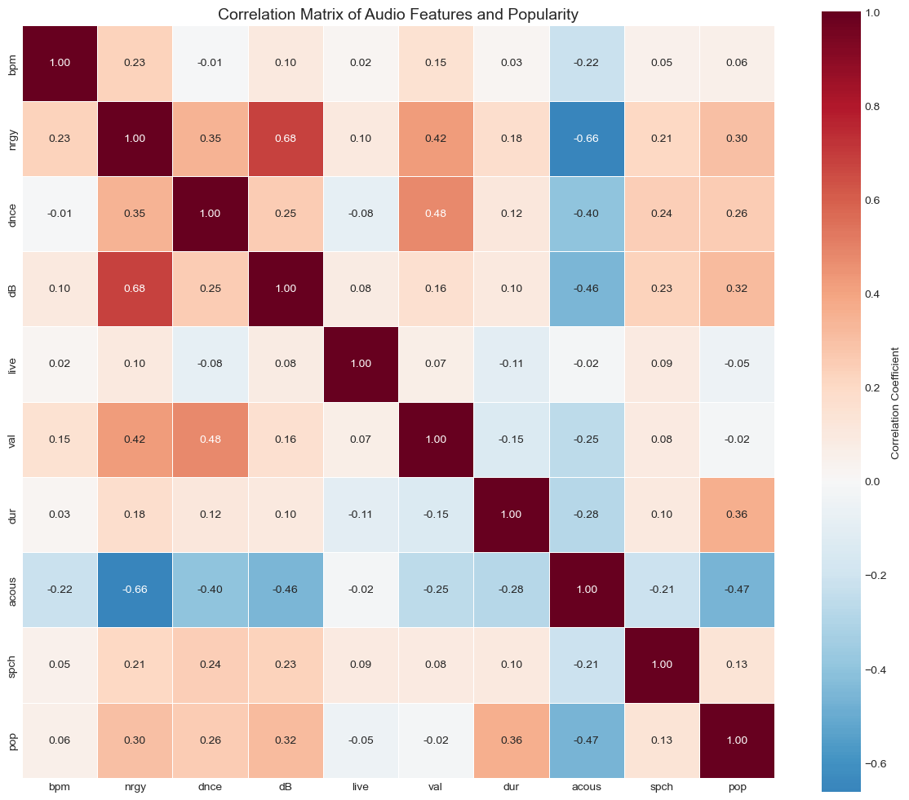
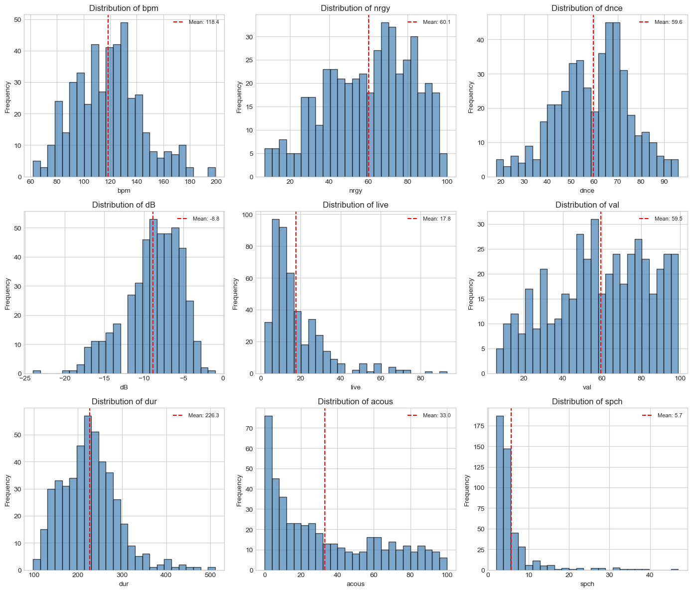
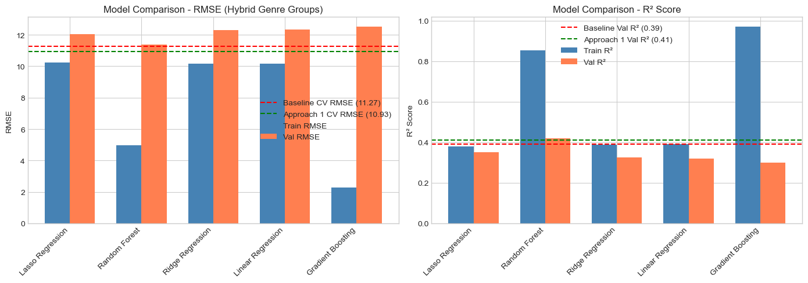

# Spotify Song Popularity Prediction 🎵 &nbsp; [](spotify_popularity_prediction.ipynb)


> **Predicting Spotify song popularity from audio features using regression — achieving a best CV RMSE of 10.80 through systematic feature engineering across 4 experimental approaches.**

<br>

<p align="center">
  
  &nbsp;&nbsp;
  
  &nbsp;&nbsp;
  
  &nbsp;&nbsp;
  
</p>

<br>

## Table of Contents

- [Problem Statement](#problem-statement)
- [Dataset](#dataset)
- [Approaches](#approaches)
  - [Baseline Model](#baseline-model)
  - [Approach 1: Genre Encoding](#approach-1-genre-encoding)
  - [Approach 2: Hybrid Genre Grouping](#approach-2-hybrid-genre-grouping)
  - [Approach 3: Feature Engineering](#approach-3-feature-engineering-)
- [Visualizations](#visualizations)
- [Results Summary](#results-summary)
- [Key Findings](#key-findings)
- [Engineered Features](#engineered-features)
- [Technologies Used](#technologies-used)
- [Repository Structure](#repository-structure)
- [How to Run](#how-to-run)
- [Author](#author)

<br>

## Problem Statement

What makes a song popular on Spotify? This project predicts song **popularity scores** using audio features and metadata from the [CS-985-6 Spotify Regression Problem 2026](https://www.kaggle.com/competitions/cs-985-6-spotify-regression-problem-2026) Kaggle competition. Through **4 iterative approaches**, each building on insights from the previous one, the project systematically improves predictions by exploring genre encoding strategies and feature engineering techniques.

<br>

## Dataset

| Property | Detail |
|----------|--------|
| **Source** | [Kaggle — CS-985-6 Spotify Regression](https://www.kaggle.com/competitions/cs-985-6-spotify-regression-problem-2026) |
| **Training Set** | 453 songs, 15 features |
| **Test Set** | 114 songs |
| **Target** | `pop` — popularity score |

### Audio Features

| Feature | Description | Range |
|---------|-------------|-------|
| `bpm` | Beats per minute (tempo) | — |
| `nrgy` | Energy level | 0–100 |
| `dnce` | Danceability | 0–100 |
| `dB` | Loudness in decibels | — |
| `live` | Liveness | 0–100 |
| `val` | Valence / positivity | 0–100 |
| `dur` | Duration in seconds | — |
| `acous` | Acousticness | 0–100 |
| `spch` | Speechiness | 0–100 |
| `top genre` | Genre classification | Categorical |

### Top Correlations with Popularity

| Feature | Correlation |
|---------|------------|
| `dur` (Duration) | **+0.36** |
| `dB` (Loudness) | **+0.32** |
| `acous` (Acousticness) | **−0.47** |

<p align="center">
  
</p>
<p align="center"><em>Correlation matrix revealing relationships between audio features and popularity</em></p>

<br>

## Approaches

### Baseline Model
- Used **numerical features only** (9 features)
- Best model: Random Forest
- **CV RMSE: 11.27** · Val R²: 0.39

### Approach 1: Genre Encoding
- One-hot encoded the **top 15 most frequent genres**
- 25 total features (9 numerical + 16 genre dummies)
- **CV RMSE: 10.93** · Val R²: 0.41

```python
# Encode top 15 genres as separate binary features
TOP_N_GENRES = 15
top_genres = train_df['top genre'].value_counts().head(TOP_N_GENRES).index.tolist()

def encode_genres(df, top_genres):
    df['genre_simplified'] = df['top genre'].apply(
        lambda x: x if x in top_genres else 'other'
    )
    return pd.concat([df, pd.get_dummies(df['genre_simplified'], prefix='genre')], axis=1)
```

### Approach 2: Hybrid Genre Grouping
- Grouped similar genres into **broader categories** (rock, pop, dance, etc.)
- 19 total features (9 numerical + 10 genre groups)
- **CV RMSE: 11.05** · Val R²: 0.35
- ❌ Did not outperform Approach 1 — granularity matters

### Approach 3: Feature Engineering ✅
- Built on Approach 1's genre encoding
- Created **25 engineered features** across 5 categories
- Best model: **Ridge Regression**
- **CV RMSE: 10.80** ✅ Best result!

```python
# Composite "Party Score" — high energy + danceable + positive - acoustic
df['party_score'] = (df['nrgy'] + df['dnce'] + df['val'] - df['acous']) / 4

# Composite "Chill Score" — acoustic + calm + low energy
df['chill_score'] = (df['acous'] + (100 - df['nrgy']) + (100 - df['dnce'])) / 3
```

<br>

## Visualizations

<p align="center">
  
</p>
<p align="center"><em>Distribution of all 9 audio features with mean indicators</em></p>

<p align="center">
  
</p>
<p align="center"><em>Model comparison across RMSE and R² metrics — Hybrid Genre Grouping approach</em></p>

<br>

## Results Summary

| Approach | CV RMSE | Val R² | Features | Best Model |
|----------|---------|--------|----------|------------|
| Baseline (no genre) | 11.27 | 0.39 | 9 | Random Forest |
| Approach 1 (top 15 genres) | 10.93 | 0.41 | 25 | Random Forest |
| Approach 2 (hybrid groups) | 11.05 | 0.35 | 19 | Lasso |
| **Approach 3 (feature engineering)** | **10.80** | **0.40** | **25** | **Ridge** |

### Model Comparison (Approach 3)

| Model | CV RMSE | Val R² |
|-------|---------|--------|
| **Ridge** | **10.80** ✅ | 0.40 |
| Lasso | 10.81 | 0.42 |
| Gradient Boosting (tuned) | 10.92 | 0.40 |
| Random Forest | 10.93 | 0.44 |
| ElasticNet | 11.00 | 0.40 |

<br>

## Key Findings

1. **Genre matters** — Adding genre features improved predictions by 3% over the baseline
2. **Granularity helps** — Keeping genres separate (Approach 1) outperformed grouping them (Approach 2)
3. **Feature engineering works** — Ridge regression with engineered features achieved the best CV RMSE
4. **Acoustic songs are less popular** — Acousticness had the strongest negative correlation (−0.47)
5. **Longer, louder songs tend to be more popular** — Duration (+0.36) and loudness (+0.32) are key drivers
6. **Linear models win** — Ridge/Lasso outperformed tree-based models on this dataset, suggesting linear relationships dominate

<br>

## Engineered Features

| Category | Features | Example |
|----------|----------|---------|
| **Interactions** | `nrgy_x_dnce`, `nrgy_x_val`, `nrgy_x_dB`, `dnce_x_val`, `dnce_x_bpm`, `acous_x_nrgy` | Energy × Danceability |
| **Ratios** | `nrgy_per_bpm`, `dnce_per_nrgy`, `val_per_nrgy`, `spch_per_dur` | Dance efficiency per energy |
| **Polynomial** | `dur_squared`, `acous_squared`, `dB_squared`, `nrgy_squared` | Capture non-linear effects |
| **Binned** | `bpm_slow/medium/fast`, `low/high_energy`, `is_acoustic`, `short/long_song` | Categorical discretization |
| **Composite** | `party_score`, `chill_score`, `vocal_score` | Domain-inspired indices |

### Most Predictive Engineered Features

| Feature | Correlation with Popularity |
|---------|----------------------------|
| `short_song` | −0.53 |
| `acous_squared` | −0.46 |
| `chill_score` | −0.44 |
| `is_acoustic` | −0.39 |
| `party_score` | +0.34 |

<br>

## Technologies Used

| Tool | Purpose |
|------|---------|
| Python 3.12 | Core language |
| Pandas | Data manipulation |
| NumPy | Numerical computing |
| Scikit-learn | Models (Ridge, Lasso, Random Forest, Gradient Boosting), cross-validation, metrics |
| Matplotlib | Visualizations |
| Seaborn | Statistical plots |
| Jupyter Notebook | Interactive development |

<br>

## Repository Structure

```
├── README.md
├── data/
│   ├── CS98XRegressionTrain.csv              # Training data (453 songs)
│   └── CS98XRegressionTest.csv               # Test data (114 songs)
├── images/                                    # Visualizations for README
├── spotify_popularity_prediction.ipynb        # Main EDA & baseline notebook
├── approach1_genre_separate.ipynb             # Top 15 genres approach
├── approach2_genre_hybrid.ipynb               # Hybrid genre grouping
├── approach3_feature_engineering.ipynb         # Feature engineering (BEST)
├── submission.csv                             # Baseline predictions
├── submission_approach1_genre_separate.csv
├── submission_approach2_hybrid.csv
└── submission_approach3_feature_engineering.csv  # Best submission
```

<br>

## How to Run

```bash
# Clone the repository
git clone https://github.com/ouyale/Spotify-Song-Popularity-Prediction.git
cd Spotify-Song-Popularity-Prediction

# Install dependencies
pip install pandas numpy scikit-learn matplotlib seaborn jupyter

# Run the notebooks (recommended order)
jupyter notebook spotify_popularity_prediction.ipynb    # Start here: EDA + Baseline
jupyter notebook approach1_genre_separate.ipynb          # Genre encoding
jupyter notebook approach2_genre_hybrid.ipynb            # Genre grouping
jupyter notebook approach3_feature_engineering.ipynb      # Best approach
```

<br>

## Author

**Barbara Obayi** — Machine Learning Engineer

[](https://github.com/ouyale)
[](https://www.linkedin.com/in/barbara-weroba-obayi31/)
[](https://ouyale.github.io)

---
