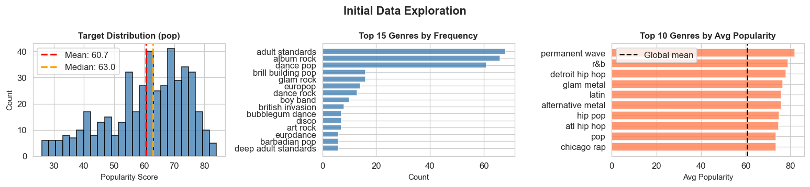
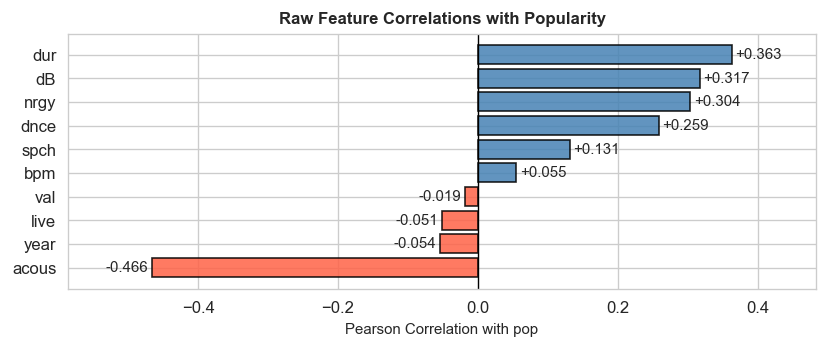
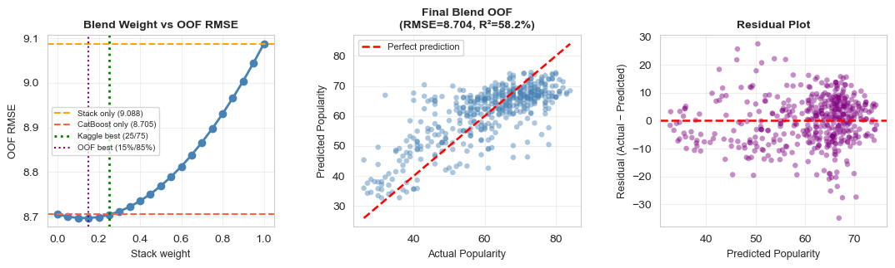
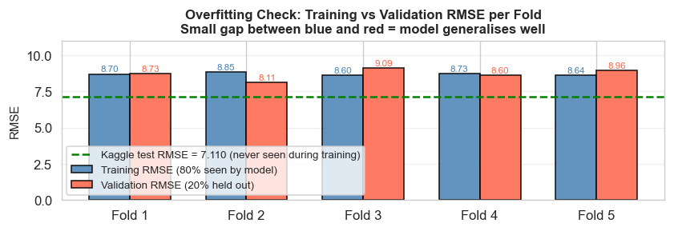

# Spotify Song Popularity Prediction


Predicting Spotify song popularity using audio features, genre information and a stacking ensemble combined with CatBoost native text processing. Final submission achieved **Kaggle RMSE 7.110** on the held-out leaderboard.

---

## Table of Contents

- [Problem Statement](#problem-statement)
- [Dataset](#dataset)
- [Pipeline Overview](#pipeline-overview)
- [Exploratory Data Analysis](#exploratory-data-analysis)
- [Feature Engineering](#feature-engineering)
- [Modelling](#modelling)
- [Results](#results)
- [Project Structure](#project-structure)
- [How to Run](#how-to-run)
- [Author](#author)

---

## Problem Statement

Given a dataset of 453 Spotify songs with audio features and genre labels, the goal is to predict each song's **popularity score** (0-100). The competition metric is Root Mean Squared Error (RMSE). The key challenges are:

- Small dataset (453 training samples) requiring careful regularisation
- High-cardinality genre column (100+ unique values) needing robust encoding
- Risk of data leakage if preprocessing is not strictly fold-scoped

---

## Dataset

| Property | Details |
|---|---|
| Source | [Kaggle CS-985-6 Spotify Regression 2026](https://www.kaggle.com/competitions/cs-985-6-spotify-regression-problem-2026) |
| Training size | 453 songs |
| Test size | 114 songs |
| Target | Popularity score (0 to 100) |

### Audio Features

| Feature | Description |
|---|---|
| `bpm` | Beats per minute (tempo) |
| `nrgy` | Energy level (0-100) |
| `dnce` | Danceability (0-100) |
| `dB` | Loudness in decibels |
| `live` | Liveness (0-100) |
| `val` | Valence, musical positivity (0-100) |
| `dur` | Duration in seconds |
| `acous` | Acousticness (0-100) |
| `spch` | Speechiness (0-100) |
| `top genre` | Genre string (100+ unique values) |

---

## Pipeline Overview

The final pipeline has four main stages:

**1. Data Loading and Swap Guard** -- a helper checks whether the target column `pop` is in the expected file and swaps train/test if needed, guarding against accidental argument reversal.

**2. Preprocessing inside each fold** -- genre imputation, Leave-One-Out (LOO) encoding, one-hot dummies and all feature engineering are fitted on fold-train only and applied to fold-validation, eliminating data leakage.

**3. Stacking ensemble** -- 10 diverse base models (Ridge, Lasso, ElasticNet, Random Forest, Extra Trees, Gradient Boosting, HistGradientBoosting, XGBoost, LightGBM, SVR) generate out-of-fold predictions that an Extra Trees meta-learner combines.

**4. CatBoost with native text** -- 8 CatBoost variants (4 random seeds x 2 text-processing modes) process the raw genre string directly. Their averaged predictions are blended with the stacking output at a 25/75 ratio.

---

## Exploratory Data Analysis

### Feature Distributions and Target

Distributions of all audio features plotted against the popularity target reveal which features have the strongest linear relationships.



### Correlations with Popularity

After computing Spearman correlations with the target inside each fold, duration and acousticness consistently appear as the strongest predictors.



---

## Feature Engineering

Features were built in three groups, all computed strictly inside each cross-validation fold:

**Interaction terms** -- multiplicative combinations that capture joint effects (e.g. energy x danceability for party tracks, acousticness x valence for relaxed songs).

**Temporal and decade features** -- song release year is binned into decades. Recency is encoded as years since 2000. These capture how chart norms shift over time.

**Artist and genre flags** -- binary flags for artists with multiple entries in the dataset (high-volume artists tend to have more consistent popularity). Genre-like combination flags detect clusters such as "dance pop" or "hip hop" that behave differently from their parent genres.

**LOO genre encoding** -- Leave-One-Out mean-target encoding replaces the raw genre string with a smoothed mean popularity per genre, computed only on fold-train rows. This avoids leakage while preserving genre signal far better than one-hot encoding for high-cardinality text.

---

## Modelling

### Base Models

Ten base models were chosen to cover four model families, ensuring diverse inductive biases in the stacking feature matrix:

| Family | Models | Why |
|---|---|---|
| Linear | Ridge, Lasso, ElasticNet | Strong baseline on small datasets; complementary regularisation |
| Tree ensembles | Random Forest, Extra Trees, HistGradientBoosting | Non-linear interactions; robust to outliers |
| Boosting | XGBoost, LightGBM, Gradient Boosting | Sequential error correction; historically strong on tabular data |
| Kernel | SVR (RBF) | Captures non-linear structure in a different feature space |

### Stacking

Out-of-fold predictions from all 10 base models form a meta-feature matrix. An Extra Trees meta-learner is trained on this matrix to learn which base models to trust and in which regions of the feature space.

### CatBoost

CatBoost processes the raw `top genre` text column natively using its built-in text feature support (bag-of-words and TF-IDF modes). Eight variants are averaged to reduce variance from random seed effects.

### Blending

The final prediction is a weighted blend:

```
prediction = 0.25 x stacking + 0.75 x CatBoost
```

The 25/75 ratio was selected by sweeping blend weights on out-of-fold predictions.



---

## Results

### Final Performance

| Metric | OOF (local) | Kaggle (leaderboard) |
|---|---|---|
| RMSE | 8.7040 | 7.1100 |
| R-squared | 58.2% | -- |

The gap between OOF and Kaggle RMSE is positive (Kaggle is better), suggesting the model generalises well and the test set may be slightly easier than the training folds.

### Overfitting Check

Training RMSE per fold versus validation RMSE confirm no severe overfitting. The gap between training and validation is consistent across all five folds.



---

## Project Structure

```
Spotify-Song-Popularity-Prediction/
|
|-- data/
|   |-- CS98XRegressionTrain.csv      # Training data (453 songs)
|   |-- CS98XRegressionTest.csv       # Test data (114 songs)
|
|-- spotify_final/
|   |-- FINAL_regression.ipynb        # Full regression pipeline (executed)
|
|-- FINAL_combined.ipynb              # Combined regression + classification report notebook
|-- FINAL_combined_with_code.pdf      # Submitted report PDF
|-- submission_final.csv              # Best Kaggle submission (RMSE 7.110)
|
|-- final_01_exploration.png          # EDA charts
|-- final_02_correlations.png         # Correlation analysis
|-- final_03_blend_results.png        # Blend sweep results
|-- final_05_overfitting_check.png    # Overfitting diagnostic
|
|-- README.md
```

---

## How to Run

### 1. Clone the Repository

```bash
git clone https://github.com/ouyale/Spotify-Song-Popularity-Prediction.git
cd Spotify-Song-Popularity-Prediction
```

### 2. Install Dependencies

```bash
pip install numpy pandas scikit-learn xgboost lightgbm catboost matplotlib seaborn jupyter
```

### 3. Run the Notebook

Open `spotify_final/FINAL_regression.ipynb` and run all cells. The notebook will:

1. Load and validate the data
2. Run 5-fold cross-validation with the full preprocessing pipeline inside each fold
3. Train the stacking ensemble and 8 CatBoost variants
4. Sweep blend weights and select the best ratio
5. Generate `submission_final.csv` for Kaggle upload

---

## Author

**Barbara Weroba Obayi**

[](https://github.com/ouyale)
[](https://www.linkedin.com/in/barbara-obayi/)
